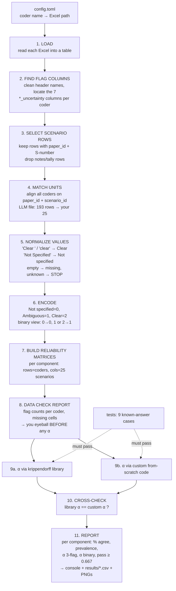

clean up the naming, threshold/status logic, and printed report.

# Krippendorff's Alpha: Reliability of Threat-Model Component Coding

Human coders independently flag a random sample of 25 scenarios (one per paper, 25 papers) using the same codebook as the LLM. The scripts here measure agreement between `coders`, `human (mentee) vs human (mentee)` and `human vs LLM`, with **Krippendorff's alpha (α)**, the standard chance-corrected reliability coefficient in content analysis.

The seven components: _threat source, objective or harmful outcome, capability, knowledge, access, constraints or enabling conditions, target or asset at risk._

## What Krippendorff's alpha measures

Two coders can agree simply by chance, especially when one flag dominates. Alpha removes that chance agreement:    

$α = 1 − Dₒ / Dₑ$

- **Dₒ (observed disagreement):** how often coders actually gave different flags to the same scenario.
- **Dₑ (expected disagreement):** how often two flags drawn at random from *all* flags given (pooled across coders, without replacement) would differ.

| α             | Meaning                                     |
| -------------- | ------------------------------------------- |
| 1              | perfect agreement                           |
| 0              | no better than chance                       |
| < 0            | systematic disagreement (worse than chance) |
| ≥ 0.800       | reliable                                    |
| 0.667 – 0.800 | acceptable for tentative conclusions only   |
| < 0.667        | do not rely on the data                     |

## Why two implementations

1. **`ka_script_lib.py`** uses the [`krippendorff`](https://github.com/pln-fing-udelar/fast-krippendorff) Python package (v0.9.0).
2. **`ka_script_custom.py`** is our from-scratch implementation of the four steps in
   Krippendorff (2011): reliability data matrix → coincidence matrix → difference function → α. _[for cross check]_

## Project layout

```
krippendorff-alpha/
├── config.toml              # coders: name, kind (human / llm), Excel file, sheet
├── data_preprocessing.py    # shared: load, clean, match, encode, matrices, --human/--llm
├── ka_script_lib.py         # alpha via the krippendorff package
├── ka_script_custom.py      # alpha from scratch (Krippendorff 2011), checked against the library
├── helper_visual_lp_chart.py           # lollipop chart (1 card for --human, 2 x 2 for --llm)
├── helper_visual_comparison_table.py   # comparison tables: coders' raw labels side by side
├── tests/                   # published + hand-computed test cases
├── materials/               # coding sheets (not for public release)
└── results/                 # generated CSV + PNG files
```

## Setup and run (uv)

```Shell
uv sync
uv run pytest -q                        # tests must pass

# one flag is required; without it the script prints this usage guide
uv run python ka_script_lib.py --human  # human coders (mentees) with each other
uv run python ka_script_lib.py --llm    # the same, plus each human vs each LLM, plus all combined

uv run python ka_script_custom.py --human   # same flags; also checks every alpha against the library
uv run python ka_script_custom.py --llm
```

Who counts as human or LLM is set by `kind` in `config.toml`. `--human` never loads an LLM sheet.
`--llm` ends with a **Combined (llm+human)** comparison: one alpha per component over all coders
together (same CSV, last rows). It shows overall consistency but not *who* disagrees, so read it
with the pairwise results. Its label grid is green only where every coder agrees.

## Reading the output

1. **DATA CHECK.** Flag counts per coder per component. Review these first: if they are wrong, every α after them is wrong.
2. **α table.** Per component: number of scenarios, % agreement and α for both views, and the verdict against 0.667.
   `n/a` with verdict `no variation` is **not an error**: every coder gave the same flag to every scenario
   (e.g. all Clear), so D_o = D_e = 0 and α = 0/0. Agreement is 100%, but α has nothing to measure.
   In the CSV, such an α is an empty cell.
3. **`results/<lib|custom>_ka_result_<human|llm>_<timestamp>.csv`**: the same table, with each coder's flag counts.
4. **`results/<lib|custom>_ka_chart_<human|llm>_<timestamp>.png`**: lollipop chart of the 3-flag α per component,
   with the 0.667 / 0.800 thresholds and % agreement beside each row. One card for `--human`; a 2 x 2 grid of
   cards for `--llm` (humans, each mentee vs the LLM, combined), all on the same α scale.
5. **`results/<lib|custom>_ka_labels_<comparison>_<timestamp>.png`**: one per comparison. Each coder's raw labels
   (C / A / N) for the 25 scenarios x 7 components, side by side. Green = same flag from every coder;
   red with a bold, outlined letter = flags differ. The bottom row counts matching scenarios per component.

| Column                  | In simple words                                                                                                                                                                                                                                                                | Example (constraints row)              |
| ----------------------- | ------------------------------------------------------------------------------------------------------------------------------------------------------------------------------------------------------------------------------------------------------------------------------ | -------------------------------------- |
| `comparison`          | Which coders are being compared                                                                                                                                                                                                                                                | `humans`                             |
| `component`           | Which of the 7 components                                                                                                                                                                                                                                                      | `constraints_or_enabling_conditions` |
| `n_units`             | `How many scenarios both coders flagged (comparable). Lower than 25 only if someone left a cell empty`                                                                                                                                                                       | `25`                                 |
| `pct_agree_3flag`     | Share of scenarios where you gave**exactly the same flag** (Clear = Clear, Ambiguous = Ambiguous, Not specified = Not specified). **Doesn't account for luck**                                                                                                     | `0.72` → you matched on 18 of 25    |
| `alpha_3flag`         | Krippendorff's α on the 3 flags: agreement**after removing luck** . 1 = perfect, 0 = no better than chance, below 0 = systematic disagreement. Pass mark 0.667.<br />`It's a **reliability value** (agreement after removing chance), **not** a disagreement value:)` | `0.249`                              |
|                         |                                                                                                                                                                                                                                                                                |                                        |
| `pct_agree_binary`    | Share of scenarios where you agreed on**present vs absent** only. Clear and Ambiguous both count as "present", so Clear vs Ambiguous counts as **agreement** here                                                                                                  | `0.88` → you matched on 22 of 25    |
| `alpha_binary`        | α on present vs absent, the paper's own definition of "specified"                                                                                                                                                                                                             | `0.512`                              |
| `flags_mentee_adya`   | How many times you used each flag for this component:**C**lear, **A**mbiguous, **N**ot specified. Adds `missing=…` if you left cells empty                                                                                                                | `C=17 A=4 N=4`                       |
| `flags_mentee_rujuta` | The same counts for Rujuta                                                                                                                                                                                                                                                     | `C=22 A=0 N=3`                       |

- [X] Shared data pipeline and library implementation
- [X] From-scratch implementation + cross-check
- [ ] Bootstrap confidence intervals
- [X] Second human coder; human-vs-human α
- [ ] Consensus labels; LLM precision/recall vs consensus

## References

- Krippendorff, K. (2011). *Computing Krippendorff's Alpha-Reliability.* Annenberg School
  for Communication. [PDF](<https://www.asc.upenn.edu/sites/default/files/2021-03/Computing%20Krippendorff%27s%20Alpha-Reliability.pdf>)
- Hayes, A. F., & Krippendorff, K. (2007). Answering the call for a standard reliability measure for coding data. *Communication Methods and Measures*, 1(1), 77–89. [www.afhayes.com/public/kalpha.pdf](https://www.afhayes.com/public/kalpha.pdf)
- Krippendorff, K. (2004/2013). *Content Analysis: An Introduction to Its Methodology.* Sage.
- Feinstein, A. R., & Cicchetti, D. V. (1990). High agreement but low kappa: I. The
  problems of two paradoxes. *Journal of Clinical Epidemiology*, 43(6), 543–549.
- [fast-krippendorff](https://github.com/pln-fing-udelar/fast-krippendorff), the `krippendorff` Python packag

### Why we are using Krippendorff's alpha

```
                  scenarios
                      │
          ┌───────────┴───────────┐
          ↓                       ↓
     Human coder 1           Human coder 2
          │                       │
          └───────────┬───────────┘
                      ↓
             Compare classifications
                      │
             ┌────────┴────────┐
             │                 │
          Agree             Disagree
             │                 │
             ↓                 ↓
       Keep agreement      Discuss/review
                               │
                               ↓
                         Consensus decision
                               │
                               ↓
                          GOLD STANDARD

Then:

              LLM
               │
               ↓
       Same 25 scenarios
               │
               ↓
       Same 7 components
               │
               ↓
 Clear / Ambiguous / Not specified
               │
               ↓
       Compare against
       human consensus
       gold standard
```

## FULL PIPELINE (STEPS)



### Each step in plain words

1. **Load.** Read each Excel file into a table (pandas). Nothing is changed yet.
2. **Find the flag columns.** Your header names are messy: `'objective_or_harmful_outcome_uncertainty\n'` has a hidden line break, and `'access_uncertaintyt'` has a typo. The script cleans the names (removes spaces and line breaks, lowercases them). Then, for each component, it finds **exactly one** column that starts with the component's name and contains "uncert". Evidence columns are ignored. If a column is missing or two match, it **stops** and says which.
3. **Select scenario rows.** Keep only rows with a `paper_id` and a scenario ID like `S4`. Your sheet has **4 notes rows at the bottom** (`total_ambiguous: 16`, `total_clear …`, and so on). They get skipped and listed in the data check.
4. **Match units.** A "unit" is one scenario, identified by `paper_id` + `scenario_id`. Your 25 keys define the set. From the LLM file (193 rows) it takes just those 25. If any coder is missing a key, or has it twice, it **stops**. (I checked: all 25 of your keys exist in the library exactly once.)
5. **Normalize values.** Fix the spelling variants. Your sheet has 8 different spellings:

   | In your sheet                                          | Becomes                                         |
   | ------------------------------------------------------ | ----------------------------------------------- |
   | `'Clear'`, `'Clear '`, `'clear'`                 | Clear                                           |
   | `'Ambiguous'`, `'\nAmbiguous'`, `'Ambiguous \n'` | Ambiguous                                       |
   | `'Not Specified'`, `'Not specified'`               | Not specified                                   |
   | empty                                                  | missing                                         |
   | anything else, e.g.`'Maybe'`                         | **STOP** with coder, row and column named |

   The LLM file is already clean: only `Clear`, `Ambiguous`, `Not specified`.
6. **Encode.** Turn words into numbers, because α works on numbers: Not specified = 0, Ambiguous = 1, Clear = 2. Also make a **binary copy** (0 → 0, 1 or 2 → 1), which matches the paper's "specified".
7. **Build reliability matrices.** For each of the 7 components, one small table: one row per coder, one column per scenario, as in the guide's Step ①.

   ```
   access (binary)   unit1 unit2 unit3 ... unit25
   adya                1     0     1   ...   1
   llm                 0     0     1   ...  NaN   ← NaN = missing
   ```
8. **Data check (before any α).** Print and save: how many of each flag each coder used, which cells are missing, and which rows were skipped. **You look at this first.** If something's wrong here, every α after it is wrong.
9. **Compute.** The same matrices go to both engines:

   - **9a, library:** `krippendorff.alpha(…, level_of_measurement="nominal")`. The level is always set explicitly, never left at the default.
   - **9b, custom:** coincidence matrix → D_o → D_e → α, written by us from the 2011 guide.
   - Both also get: % agreement, prevalence, and "undefined" handling when everyone gives the same flag.
10. **Cross-check.** If library α and custom α differ by more than a tiny amount (e.g. 0.000001), the script flags it.
