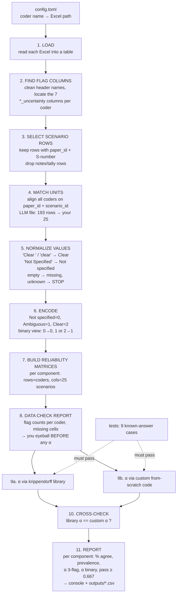

### Why Two Script?

Use two script, 1) Python library and 2) Custom script with our understanding and refernces for cross check

* Krippendorff (2011), Computing Krippendorff-Alpha-Reliability (PDF) _Penn repository use this same paper_
* [fast-krippendorff (the `krippendorff` Python package)](https://github.com/pln-fing-udelar/fast-krippendorff)

**Layout** (5 code files):

```Markdown
krippendorff-alpha/
├── pyproject.toml              ← uv project: pandas, openpyxl, numpy, krippendorff, pytest
├── config.toml                 ← WHICH sheets to compare (coder name → file path)
├── materials/                  ← your Excel inputs
├── kalpha_data.py              ← SHARED: load → clean → match → encode → build matrices
├── krippendorff_python_lib/
│   └── alpha_lib.py            ← computes α with the `krippendorff` library
├── custom_krippendorff/
│   └── alpha_custom.py         ← computes α from scratch (Krippendorff 2011 steps)
├── run_compare.py              ← runs both, checks they agree, writes the report
├── tests/test_known_answers.py ← the 9 known-answer cases (.095, .692, .743 …)
└── outputs/                    ← CSV reports (generated)
```

---

## Expected Pipeline of Krippendorff's Alpha

### a) Giving Input

List all excel sheets once in a small `config.toml`, one entry per "coder":

```toml
[coders.mentee_adya]
file  = "materials/25_random_scenario_judgement_adya.xlsx"
[coders.llm_kimi]
file  = "../loss-of-control-definition/materials/scenario_final_resolved.xlsx"
sheet = "Sheet1"
# later, one more line pair:
# [coders.mentee2]
# file = "materials/25_random_scenario_judgement_<name>.xlsx"
```

Then a single command runs everything: `uv run python run_compare.py`. Adding the other mentee later is just one more entry. The LLM's flags aren't in your `krippendorff-alpha/materials` folder; the config can point at the repo's copy, or you can copy the file in.

### *The pipeline*



### Each step in plain words

1. **Load.** Read each Excel file into a table (pandas). Nothing is changed yet.
2. **Find the flag columns.** Your header names are messy: `'objective_or_harmful_outcome_uncertainty\n'` has a hidden line break, and `'access_uncertaintyt'` has a typo. The script cleans the names (removes spaces and line breaks, lowercases them). Then, for each component, it finds **exactly one** column that starts with the component's name and contains "uncert". Evidence columns are ignored. If a column is missing or two match, it **stops** and says which.
3. **Select scenario rows.** Keep only rows with a `paper_id` and a scenario ID like `S4`. Your sheet has **4 notes rows at the bottom** (`total_ambiguous: 16`, `total_clear …`, and so on). They get skipped and listed in the data check.
4. **Match units.** A "unit" is one scenario, identified by `paper_id` + `scenario_id`. Your 25 keys define the set. From the LLM file (193 rows) it takes just those 25. If any coder is missing a key, or has it twice, it **stops**. (I checked: all 25 of your keys exist in the library exactly once.)
5. **Normalize values.** Fix the spelling variants. Your sheet has 8 different spellings:

   | In your sheet                                          | Becomes                                         |
   | ------------------------------------------------------ | ----------------------------------------------- |
   | `'Clear'`, `'Clear '`, `'clear'`                 | Clear                                           |
   | `'Ambiguous'`, `'\nAmbiguous'`, `'Ambiguous \n'` | Ambiguous                                       |
   | `'Not Specified'`, `'Not specified'`               | Not specified                                   |
   | empty                                                  | missing                                         |
   | anything else, e.g.`'Maybe'`                         | **STOP** with coder, row and column named |

   The LLM file is already clean: only `Clear`, `Ambiguous`, `Not specified`.
6. **Encode.** Turn words into numbers, because α works on numbers: Not specified = 0, Ambiguous = 1, Clear = 2. Also make a **binary copy** (0 → 0, 1 or 2 → 1), which matches the paper's "specified".
7. **Build reliability matrices.** For each of the 7 components, one small table: one row per coder, one column per scenario, as in the guide's Step ①.

   ```
   access (binary)   unit1 unit2 unit3 ... unit25
   adya                1     0     1   ...   1
   llm                 0     0     1   ...  NaN   ← NaN = missing
   ```
8. **Data check (before any α).** Print and save: how many of each flag each coder used, which cells are missing, and which rows were skipped. **You look at this first.** If something's wrong here, every α after it is wrong.
9. **Compute.** The same matrices go to both engines:

   - **9a, library:** `krippendorff.alpha(…, level_of_measurement="nominal")`. The level is always set explicitly, never left at the default.
   - **9b, custom:** coincidence matrix → D_o → D_e → α, written by us from the 2011 guide.
   - Both also get: % agreement, prevalence, and "undefined" handling when everyone gives the same flag.
10. **Cross-check.** If library α and custom α differ by more than a tiny amount (e.g. 0.000001), the script flags it.
11. **Report.** A table you can read and paste into notes:

    ```
    component     n   %agree  prevalence(C/A/N)  α_3flag  α_binary  ≥0.667?
    threat_source 25    …          …               …        …        …
    ...
    ```

    Following our earlier agreement, before your consensus meeting the report shows **only these summary numbers**, not which rows you and the LLM labelled differently.

---

## What uv setup will look like (preview)

Run inside `krippendorff-alpha/`:

```powershell
uv init --bare                         # creates pyproject.toml only
uv add pandas openpyxl numpy krippendorff
uv add --dev pytest
uv run pytest                          # known-answer tests first
uv run python run_compare.py           # then the real comparison
```

Once you've decided the four points above, I'll write the files here in chat, starting with the shared `kalpha_data.py` and the library script as you asked, for you to paste in.
