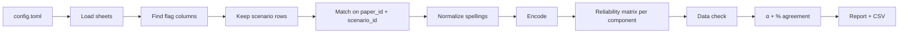
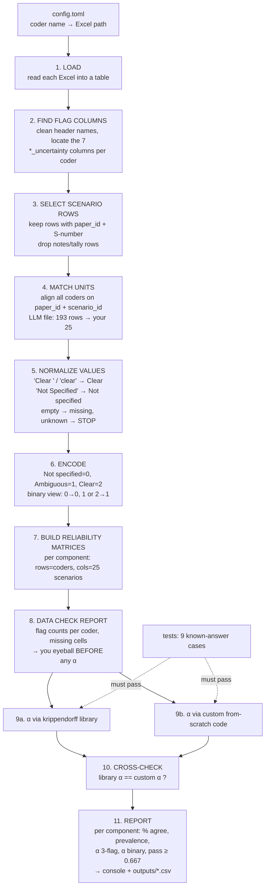

# Krippendorff's Alpha: Reliability of Threat-Model Component Coding

Human coders independently flag a random sample of 25 scenarios (one per paper, 25 papers) using the same codebook as the LLM. The scripts here measure agreement between `coders`, `human (mentee) vs human (mentee)` and `human vs LLM`, with **Krippendorff's alpha (α)**, the standard chance-corrected reliability coefficient in content analysis.

The seven components: _threat source, objective or harmful outcome, capability, knowledge, access, constraints or enabling conditions, target or asset at risk._

## What Krippendorff's alpha measures

Two coders can agree simply by chance, especially when one flag dominates. Alpha removes that chance agreement:    α = 1 − Dₒ / Dₑ

- **Dₒ (observed disagreement):** how often coders actually gave different flags to the same scenario.
- **Dₑ (expected disagreement):** how often two flags drawn at random from *all* flags given (pooled across coders, without replacement) would differ.

| α             | Meaning                                     |
| -------------- | ------------------------------------------- |
| 1              | perfect agreement                           |
| 0              | no better than chance                       |
| < 0            | systematic disagreement (worse than chance) |
| ≥ 0.800       | reliable                                    |
| 0.667 – 0.800 | acceptable for tentative conclusions only   |
| < 0.667        | do not rely on the data                     |

## Why two implementations

1. **`krippendorff_python_lib/`** uses the [`krippendorff`](https://github.com/pln-fing-udelar/fast-krippendorff) Python package (v0.9.0).
2. **`custom_krippendorff/`** is our from-scratch implementation of the four steps in
   Krippendorff (2011): reliability data matrix → coincidence matrix → difference function → α. _[for cross check]_

Both read identical cleaned data from `kalpha_data.py` and must produce the same α. Agreement between two independent implementations, plus reproducing the published  worked examples, is our evidence that the numbers are correct.

## How it works



- **Units:** the scenarios of the coder named in `units_from` (the 25 sampled scenarios). Other sheets may contain more rows (the LLM sheet has 193); they are ignored.
- **Normalization:** `'Clear '`, `'clear'` → Clear; `'Not Specified'` → Not specified; `'\nAmbiguous'` → Ambiguous. Unknown values stop the run with the exact cell named.

**### Two views:** **3 flags and **B**inary**

**- 3 flags** (Clear / Ambiguous / Not specified

**- Binary** (specified = Clear or Ambiguous vs Not specified, the paper's definition).

> Both use nominal α.

## Project layout

```
krippendorff-alpha/
├── config.toml                  # which sheets to compare
├── kalpha_data.py               # shared: load, clean, match, encode, matrices
├── krippendorff_python_lib/
│   └── alpha_lib.py             # α via the krippendorff package
├── custom_krippendorff/         # α from scratch (in progress)
├── tests/test_known_answers.py  # published + hand-computed test cases
├── materials/                   # coding sheets (not for public release)
└── outputs/                     # generated CSV reports
```

## Setup and run (uv)

```powershell
uv sync                                              # install dependencies
uv run pytest -q                                     # known-answer tests (must pass)
uv run python -m krippendorff_python_lib.alpha_lib   # run the comparison
```

## Configuration

```toml
units_from = "mentee_adya"      # must be ABOVE the first [[coders]] block

[[coders]]
name = "mentee_adya"
file = "materials/25_random_scenario_judgement_adya.xlsx"
sheet = "Sheet1"

[[coders]]
name = "llm_kimi"
file = "materials/scenario_final_resolved_llm_kimi.xlsx"
sheet = "Sheet1"

[[comparisons]]
name = "adya_vs_llm"
coders = ["mentee_adya", "llm_kimi"]
```

To add a coder, add a `[[coders]]` block and a `[[comparisons]]` entry.

## Reading the output

1. **DATA CHECK.** Flag counts per coder per component. Review these first: if they are wrong, every α after them is wrong.
2. **α table.** Per component: number of scenarios, % agreement and α for both views, and the verdict against 0.667.
3. **`outputs/alpha_lib.csv`**: the same table, with each coder's flag counts.

**Interpretation pitfalls:**

- **High agreement, low α.** When one flag dominates (e.g. threat source is almost
  always present), chance agreement is high and α drops. Always read α together with
  % agreement and flag counts (Feinstein & Cicchetti, 1990).
- **α = 0 with near-perfect agreement.** If one coder gives the same flag to every
  scenario, α cannot exceed 0.
- **Undefined α.** If every coder gives the same flag everywhere, α is 0/0 and is
  reported as `undefined`.
- **Small samples.** With 25 scenarios, one changed flag can move α substantially.
- **Reliability ≠ accuracy.** Human-vs-human α tests the codebook. Whether the LLM is
  *right* is measured separately (precision/recall against the human consensus).

## Tests

`tests/test_known_answers.py` checks that the code reproduces:

- Krippendorff (2011) worked examples: binary α = 0.095, nominal α = 0.692, and
  4 coders with missing data α = 0.743;
- hand-computed cases: α = 0.631 (3 flags), α = 0 (rare category), undefined (no variation);
- the cleaning rules (spellings, messy headers, notes rows, `units_from`).

## Status

- [X] Shared data pipeline and library implementation
- [ ] From-scratch implementation + cross-check
- [ ] Bootstrap confidence intervals
- [ ] Second human coder; human-vs-human α
- [ ] Consensus labels; LLM precision/recall vs consensus

## References

- Krippendorff, K. (2011). *Computing Krippendorff's Alpha-Reliability.* Annenberg School
  for Communication. [PDF](<https://www.asc.upenn.edu/sites/default/files/2021-03/Computing%20Krippendorff%27s%20Alpha-Reliability.pdf>)
- Hayes, A. F., & Krippendorff, K. (2007). Answering the call for a standard reliability
  measure for coding data. *Communication Methods and Measures*, 1(1), 77–89.
- Krippendorff, K. (2004/2013). *Content Analysis: An Introduction to Its Methodology.* Sage.
- Feinstein, A. R., & Cicchetti, D. V. (1990). High agreement but low kappa: I. The
  problems of two paradoxes. *Journal of Clinical Epidemiology*, 43(6), 543–549.
- [fast-krippendorff](https://github.com/pln-fing-udelar/fast-krippendorff), the `krippendorff` Python packag

### *The pipeline*



### Each step in plain words

1. **Load.** Read each Excel file into a table (pandas). Nothing is changed yet.
2. **Find the flag columns.** Your header names are messy: `'objective_or_harmful_outcome_uncertainty\n'` has a hidden line break, and `'access_uncertaintyt'` has a typo. The script cleans the names (removes spaces and line breaks, lowercases them). Then, for each component, it finds **exactly one** column that starts with the component's name and contains "uncert". Evidence columns are ignored. If a column is missing or two match, it **stops** and says which.
3. **Select scenario rows.** Keep only rows with a `paper_id` and a scenario ID like `S4`. Your sheet has **4 notes rows at the bottom** (`total_ambiguous: 16`, `total_clear …`, and so on). They get skipped and listed in the data check.
4. **Match units.** A "unit" is one scenario, identified by `paper_id` + `scenario_id`. Your 25 keys define the set. From the LLM file (193 rows) it takes just those 25. If any coder is missing a key, or has it twice, it **stops**. (I checked: all 25 of your keys exist in the library exactly once.)
5. **Normalize values.** Fix the spelling variants. Your sheet has 8 different spellings:

   | In your sheet                                          | Becomes                                         |
   | ------------------------------------------------------ | ----------------------------------------------- |
   | `'Clear'`, `'Clear '`, `'clear'`                 | Clear                                           |
   | `'Ambiguous'`, `'\nAmbiguous'`, `'Ambiguous \n'` | Ambiguous                                       |
   | `'Not Specified'`, `'Not specified'`               | Not specified                                   |
   | empty                                                  | missing                                         |
   | anything else, e.g.`'Maybe'`                         | **STOP** with coder, row and column named |

   The LLM file is already clean: only `Clear`, `Ambiguous`, `Not specified`.
6. **Encode.** Turn words into numbers, because α works on numbers: Not specified = 0, Ambiguous = 1, Clear = 2. Also make a **binary copy** (0 → 0, 1 or 2 → 1), which matches the paper's "specified".
7. **Build reliability matrices.** For each of the 7 components, one small table: one row per coder, one column per scenario, as in the guide's Step ①.

   ```
   access (binary)   unit1 unit2 unit3 ... unit25
   adya                1     0     1   ...   1
   llm                 0     0     1   ...  NaN   ← NaN = missing
   ```
8. **Data check (before any α).** Print and save: how many of each flag each coder used, which cells are missing, and which rows were skipped. **You look at this first.** If something's wrong here, every α after it is wrong.
9. **Compute.** The same matrices go to both engines:

   - **9a, library:** `krippendorff.alpha(…, level_of_measurement="nominal")`. The level is always set explicitly, never left at the default.
   - **9b, custom:** coincidence matrix → D_o → D_e → α, written by us from the 2011 guide.
   - Both also get: % agreement, prevalence, and "undefined" handling when everyone gives the same flag.
10. **Cross-check.** If library α and custom α differ by more than a tiny amount (e.g. 0.000001), the script flags it.
11. **Report.** A table you can read and paste into notes:

    ```
    component     n   %agree  prevalence(C/A/N)  α_3flag  α_binary  ≥0.667?
    threat_source 25    …          …               …        …        …
    ...
    ```
